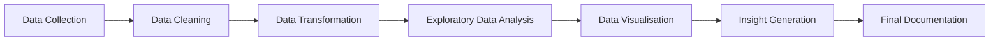

<h1 align="center">📊 Customer Account Lifecycle and Transaction Analysis</h1>

<p align="center">
  An end-to-end Data Analytics project exploring customer account lifecycle, engagement, top-up behaviour, and transaction activity using anonymised customer data.
</p>

---

## 📌 Project Overview

This project analyses anonymised customer account lifecycle data to understand how customers progress from account creation to top-up and transaction activity.

The analysis focuses on identifying patterns in:

- Account creation and verification
- Customer lifecycle progression
- Top-up behaviour and timing
- Transaction frequency and value
- Customer engagement
- Product-type behaviour
- Account-creation cohort performance
- Relationships between transaction activity and customer behaviour

The project follows an end-to-end data analytics workflow, from data cleaning and feature engineering through exploratory data analysis, visualisation, and insight generation.

---

## 🎯 Project Objectives

The key objectives of this project are to:

- Analyse account creation patterns across different years.
- Examine account verification and customer lifecycle behaviour.
- Understand the progression from account creation to top-up and transaction activity.
- Analyse how quickly customers complete their first top-up.
- Compare transaction-active and non-transaction-active accounts.
- Explore transaction frequency and transaction value.
- Investigate the relationship between transaction count and transaction value.
- Compare engagement patterns across product types.
- Analyse customer engagement across account-creation cohorts.
- Identify the strongest patterns and insights from the available data.

---

## 🗂 Dataset Description

The project uses anonymised customer account lifecycle and transaction data.

Due to data privacy and confidentiality requirements, the original company dataset is **not publicly shared**. An anonymised sample of the data is included in this repository for demonstration and reproducibility purposes.

The dataset contains information related to:

| Category | Description |
|---|---|
| Account Information | Account ID, account creation date, and account status |
| Card / Lifecycle Activity | Card activation, first top-up, first transaction, and last transaction dates |
| Customer Activity | Transaction count and transaction value |
| Product Information | Product type such as FDD and SDD |
| Derived Metrics | Lifecycle stages, top-up timing, transaction activity, and cohort metrics |

### Sample Data Files

The repository contains anonymised sample datasets:

- `combined_account_lifecycle_sample.csv`
- `DA_Final_Project_Cleaned_Dataset_sample.csv`

> **Privacy Note:** The sample datasets contain no confidential or personally identifiable information and represent only a subset of the original data used for analysis.

---

## 🛠 Tools and Technologies

| Tool / Library | Purpose |
|---|---|
| Python | Data cleaning, transformation, analysis, and visualisation |
| Pandas | Data manipulation and analysis |
| NumPy | Numerical operations and feature engineering |
| Matplotlib | Data visualisation |
| Seaborn | Statistical visualisation |
| Plotly | Interactive visualisation |
| Jupyter Notebook | Analysis, documentation, and presentation |

---

## 🔄 Project Workflow



### Project Phases

1. **Data Loading & Initial Exploration**
2. **Data Cleaning & Pre-processing**
3. **Feature Engineering**
4. **Exploratory Data Analysis**
5. **EDA Visualisation**
6. **Final Insights & Findings**

---

## 📊 Exploratory Data Analysis

The EDA covers several areas of customer behaviour.

### Account Creation

Account creation was analysed across yearly cohorts.

The dataset contains accounts created between **2020 and 2026**, with the largest number of accounts belonging to the earlier cohorts.

### Customer Lifecycle

Customer progression was examined through key lifecycle stages:

**Account Creation → Top-up → Transaction → Repeat Transaction**

This helped identify where customer engagement increases or drops throughout the lifecycle.

### Top-up Behaviour

The analysis examined:

- Accounts with and without a first top-up
- Number of days taken to complete the first top-up
- Distribution of time to first top-up
- Relationship between top-up timing and transaction activity

Among transaction-active accounts, the median time to first top-up was **9 days**, compared with **11.5 days** for accounts with no recorded transactions.

### Transaction Behaviour

Transaction activity was analysed using:

- Total transaction count
- Total transaction value
- Transaction-active vs non-active accounts
- Distribution of transaction frequency
- Distribution of transaction value

The relationship between transaction count and transaction value showed a **strong positive correlation of approximately 0.856**, indicating that accounts with more transactions generally tend to have higher total transaction value.

A log-scale scatter plot was used to make the relationship easier to interpret because of the wide range and skewness of the transaction data.

### Product Type

Transaction activity was compared between **FDD** and **SDD** products.

The two product types showed very similar engagement patterns:

| Product Type | No Transaction | Transaction Active |
|---|---:|---:|
| FDD | 15.3% | 84.7% |
| SDD | 15.1% | 84.9% |

This suggests that transaction engagement was broadly consistent across the two product types in the analysed dataset.

### Cohort Analysis

Customer engagement was also analysed by account-creation cohort.

The analysis compared:

- Top-up rate
- Transaction-active rate

Across cohorts, both measures generally declined from the earlier cohorts toward the more recent cohorts, although the **2024 cohort showed a temporary improvement** compared with 2023.

The latest cohorts also have fewer accounts and may represent incomplete customer lifecycles, so cohort comparisons should be interpreted with this limitation in mind.

---

## 🔎 Key Insights

The analysis identified several important patterns:

### 1. Customer engagement declines across newer cohorts

Earlier account-creation cohorts show higher top-up and transaction-active rates, while newer cohorts generally show lower engagement.

This may indicate that newer accounts have had less time to progress through the customer lifecycle.

---

### 2. Top-up timing is associated with transaction activity

Transaction-active customers generally complete their first top-up sooner than customers who have no recorded transactions.

The median time to first top-up was:

- **9 days** for transaction-active accounts
- **11.5 days** for accounts with no transactions

This suggests that earlier top-up behaviour may be an indicator of stronger subsequent engagement.

---

### 3. Transaction count and transaction value have a strong positive relationship

Transaction count and total transaction value have a correlation of approximately **0.856**.

As transaction frequency increases, total transaction value generally increases as well.

However, the relationship is not perfectly linear, indicating that customers with similar transaction counts can still generate different transaction values.

---

### 4. FDD and SDD show very similar transaction engagement

Transaction activity was almost identical across the two product types.

Approximately **85% of accounts in both FDD and SDD were transaction active**.

Therefore, product type does not appear to be a major differentiator of transaction engagement within this dataset.

---

### 5. Customer engagement varies considerably across account cohorts

The cohort analysis shows a noticeable difference between earlier and later account-creation years.

The 2020 cohort recorded the highest engagement rates, while the 2025 and 2026 cohorts recorded lower rates.

Because newer cohorts have had less time to mature, this pattern should not automatically be interpreted as declining product performance.

---

## 📈 Selected Visualisations

The project includes visualisations covering:

- Account creation by year
- Customer lifecycle distribution
- Time to first top-up
- Top-up timing by transaction activity
- Transaction count vs transaction value
- Log-scale transaction relationship
- Transaction activity by product type
- Customer engagement by account-creation cohort

The visualisations were selected based on their ability to support the analysis and final findings rather than simply increasing the number of charts.

---

## ⚠️ Data & Analysis Considerations

A few limitations should be considered when interpreting the results:

- The dataset is anonymised.
- The original company dataset cannot be publicly shared.
- Recent account-creation cohorts may have shorter observation periods.
- Account-level transaction data is aggregated into total transaction count and total transaction value.
- The analysis is exploratory and identifies relationships and patterns rather than proving causation.
- Some lifecycle fields may not fully represent the complete customer journey for every account.

---

## 🚀 Future Enhancements

Potential future improvements include:

- Customer segmentation based on engagement and transaction behaviour
- More detailed cohort retention analysis
- Interactive Plotly dashboards
- Customer-value segmentation
- Predictive modelling for customer engagement
- Churn or inactivity prediction, if suitable outcome data becomes available
- Automated reporting and dashboard generation

---

## 📁 Repository Structure

```text
Customer-Account-Lifecycle-and-Transaction-Analysis/
│
├── 📓 Customer_Account_Lifecycle_Analysis.ipynb
├── 📄 combined_account_lifecycle_sample.csv
├── 📄 DA_Final_Project_Cleaned_Dataset_sample.csv
├── 📄 README.md
└── 📁 visualizations/
```

> File names may be adjusted to match the final files uploaded to the repository.

---

## 👤 Author

**Belbin K Biju**

Data Analytics Enthusiast | Customer Support SME | Operations Analyst

---

<p align="center">
  ⭐ Thank you for visiting this project repository!
</p>
