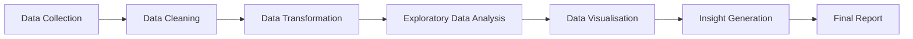

<h1 align="center">📊 Customer Account Lifecycle and Transaction Analysis</h1>

  A Data Analytics project focused on understanding account lifecycle patterns, customer engagement, and transaction activity.

---

## 📌 Project Overview

This project analyses anonymised customer account data to understand account lifecycle patterns, customer engagement, and transaction activity.

The analysis aims to identify trends in account creation, account verification, customer engagement, and transaction behaviour, generating meaningful insights through data-driven analysis.

---

## 🎯 Project Objectives

- Analyse customer account creation and lifecycle patterns.
- Examine account verification trends.
- Study customer engagement and transaction activity.
- Analyse first top-up and first transaction behaviour.
- Explore transaction frequency and transaction value.
- Identify patterns across product types and account statuses.
- Generate meaningful insights through data analysis and visualisation.

---

## 🗂 Dataset Description

The analysis is based on customer account lifecycle and transaction data.

Due to data privacy and confidentiality considerations, only anonymised sample datasets are included in this public GitHub repository for demonstration and reproducibility purposes.

The original dataset contains information related to:

| Category | Description |
|---|---|
| Account Information | Account creation date and account status |
| Customer Activity | First top-up date, first transaction date, and last transaction date |
| Transaction Information | Total transaction count and transaction value |
| Product Information | Product type classification |

### Sample Data Files

The following anonymised sample datasets are included in this repository:

- `combined_account_lifecycle_sample.csv`
- `DA_Final_Project_Cleaned_Dataset_sample.csv`

> **Note:** The sample datasets represent a subset of the actual data used in the analysis. No confidential or personally identifiable information is included in this repository.

---

## 🛠 Tools and Technologies

| Tool / Library | Purpose |
|---|---|
| Python | Data cleaning, preprocessing, and analysis |
| Pandas | Data manipulation and transformation |
| NumPy | Numerical operations and calculations |
| Matplotlib | Static data visualisation |
| Seaborn | Statistical data visualisation |
| Plotly | Interactive and dynamic visualisation |
| Jupyter Notebook | Interactive data analysis and documentation |

---

## 🔄 Project Workflow

## 🚀 Future Enhancements

Potential future improvements include:

- Advanced exploratory data analysis
- Customer segmentation
- Interactive Plotly visualisations
- Additional engagement analysis
- Predictive modelling, if appropriate for the available data
- Automated reporting and visualisation

---

## 👤 Author

**Belbin K Biju**

Data Analytics Enthusiast | Customer Support SME | Operations Analyst

---

  ⭐ Thank you for visiting this project repository!

